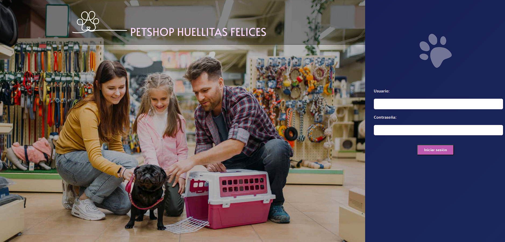

# Práctica Formativa Segunda Entrega
## Petshop HUELLITAS FELICES

### Integrantes de PINK CODE | COMISIÓN E

- GINART Nadia
- MATAYOSHI Yamila Yoshiko
- VIZGARRA Bárbara Lorena

### Asignación de Roles y Responsabilidades:

- **GINART:** 

         * FrontEnd: Diseño y aplicación de estilos en el proyecto.  

         * BackEnd: Implementación de rutas, controladores y servicios para los módulos de Turnos, Adopciones y Agenda.  
                    Migración de los módulos descriptos anteriormente a MongoDB Atlas.  

         * Despliegue del proyecto en Render.  

         * Documentación.  

- **MATAYOSHI:** 

         * BackEnd: Implementación de rutas, controladores y servicios para los módulos de Login, Registro de Usuario, Registro de Cliente, Registro de Mascotas.  
                    Migración de los módulos descriptos anteriormente a MongoDB Atlas.  

         * Autenticación y autorización con JWT.  

         * Implementación de bcrypt.  

         * Documentación.  

- **VIZGARRA:** 

         * BackEnd: Implementación de rutas, controladores y servicios para los módulos de Listado de productos y Movimiento de Stock.  
                    Migración de los módulos descriptos anteriormente a MongoDB Atlas.  

         * Configuración de MongoDB Atlas.  

         * Implementación de Websocket.  

         * Implementación de testeo con Jest y MongoMemoryServer.  

         * Documentación.  

### Alcance del proyecto:

 El sistema le permitirá a los admin registrar usuarios con acceso diferenciado por roles. Los módulos incluidos en el sistema son: 
 registro de clientes y mascotas, agenda de turnos, registro de turnos, gestión de productos y consultas del stock. 
 Los clientes podrán acceder a búsqueda de mascotas en adopción y solicitud de turnos.

 ### Nuevas Implementaciones realizadas en esta segunda entrega:

    - MongoDB Atlas: Los datos de usuarios, los turnos y los productos se gestionan en la nube con MongoDB Atlas.

    - JWT (JSON Web Tokens): Autenticación y autorización basada en tokens para los usuarios.

    - Bcrypt: Utilizado para proteger las contraseñas al ser guardadas en la base de datos a través de una función de hash. 

    - WebSockets: mediante Socket.IO para mostrar en tiempo real un contador de usuarios conectados, actualizando dinámicamente en el frontend cada vez que un usuario se conecta o desconecta

    - Jest y MongoMemoryServer: para testear el módulo de servicios de productos, validando operaciones como creación, actualización, eliminación y consulta sobre una base de datos MongoDB en memoria

### Recursos utilizados para realizar el desarrollo del proyecto:

    - [Node.js](https://nodejs.org/docs/latest/api/): Documentación oficial de Node js.

    - [Express](https://expressjs.com/): Documentación oficial de Express.

    - [Node.js Udemy](https://www.udemy.com/course/nodejs-guia-desde-cero/): Curso guía de Node js. 

    - [Pug](https://pugjs.org/api/getting-started.html): Documentación de PUG.

    - [dotenv](https://www.npmjs.com/package/dotenv): Módulo para cargar variables de entorno desde archivos .env. 

    - [Doc JSON Web Token](https://www.npmjs.com/package/jsonwebtoken): Documentación JWT. 

    - [JSON Web Token](https://www.youtube.com/watch?v=lV7mxivGX_I): Tutorial de autenticación y autorización con JWT. 

    - [bcrypt](https://www.youtube.com/watch?v=AzA_LTDoFqY): Tutorial encriptado de contraseña con bcrypt. 

    - [Node.js WebSocket](https://nodejs.org/en/learn/getting-started/websocket): Documentación de Websocket. 

    - [Socket.IO](https://socket.io/docs/v4/): Documentación de Socket.IO.

    - [Web-Socket in Node](https://www.geeksforgeeks.org/web-socket-in-node-js/): Tutorial de Websocket.

    - [MongoDB Atlas](https://www.mongodb.com/products/platform/atlas-database): Base de datos en la nube. 

    - [Mongoose](https://mongoosejs.com/): Documentación de Mongoose. 